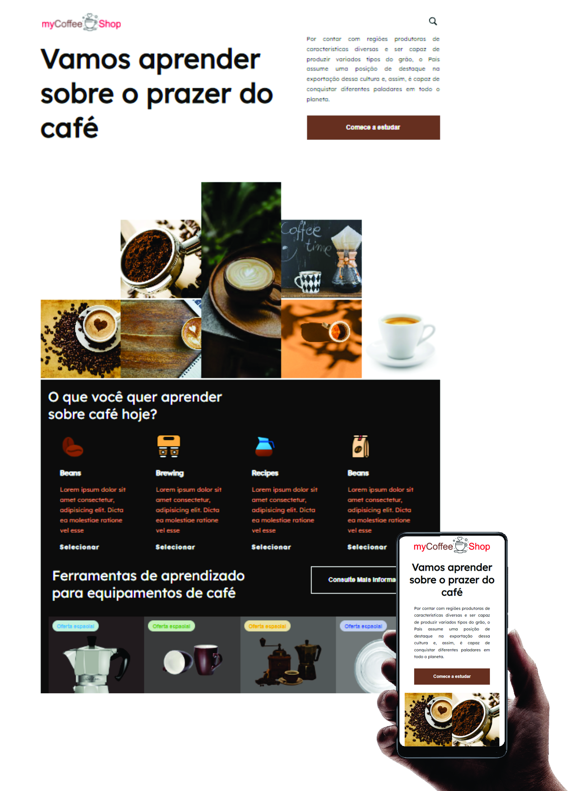

# myCoffeeShop
## Desafio 01 do nível 09 - planejamento

## :dart:  Desafio

Visite o **Dribbble** ou o **UpLabs** e escolha um projeto SIMPLES para fazer. Pode ser uma *landing page*, um formulário de contato ou então uma galeria em CSS grid. Ou outro projeto que te inspirar! 🚀

**Dica:**  a ****ideia aqui é exercitar aquele conhecimento que já está consolidado com um projeto rápido que vai deixar seu portfolio bonitão 😍 Evite escolher projetos muito complexos.

## Resumo do que foi feito
- Landing page sobre loja de café
- Display GRID
- Mobile First  

## Tecnologias

* HTML
* CSS

## :mailbox_closed: Contatos

> Email - rosendc30@gmail.com

> Linkedin - https://www.linkedin.com/in/francisco-rosendo-coelho/# gitfavorites